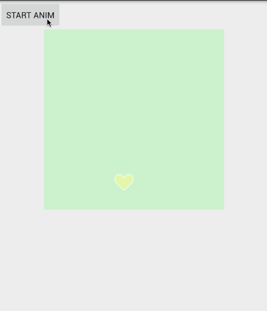

# PeriscopeSample
A layout with animation like Periscope's

一个类似Periscope点赞效果的Layout,效果如下:  

  

<!--对应的实现文章在这里:[一步一步教你实现Periscope点赞效果-->
<!--](http://www.jianshu.com/p/03fdcfd3ae9c)-->

## Usage

**Step One:**

```
     <com.tq.periscope.PeriscopeLayout
            android:id="@+id/periscope"
            android:background="#d2d2c9"
            android:layout_width="300dp"
            android:layout_height="300dp"/>
```

**Step Two:**

```
        final PeriscopeLayout periscopeLayout = (PeriscopeLayout) findViewById(R.id.periscope);
        periscopeLayout.setOnClickListener(new View.OnClickListener() {
            @Override
            public void onClick(View v) {
                periscopeLayout.addHeart();
            }
        });
```

## Contributors

[junyuecao](https://github.com/junyuecao)

## License
	Copyright (C) 2015, boobooMX
	Licensed under the Apache License, Version 2.0 (the "License");
	you may not use this file except in compliance with the License.
	You may obtain a copy of the License at
	  http://www.apache.org/licenses/LICENSE-2.0
	Unless required by applicable law or agreed to in writing, software
	distributed under the License is distributed on an "AS IS" BASIS,
	WITHOUT WARRANTIES OR CONDITIONS OF ANY KIND, either express or implied.
	See the License for the specific language governing permissions and
	limitations under the License.
